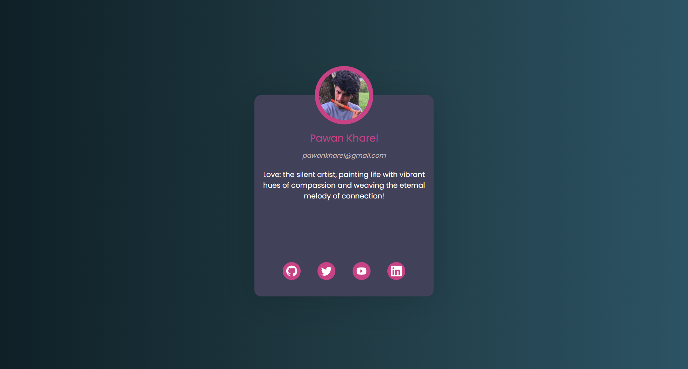

# Backend Project

This is a simple backend project built using Express.js, EJS, and other dependencies. The project allows users to create, edit, and delete posts with user details.

## Table of Contents

- [Installation](#installation)
- [Usage](#usage)
- [Dependencies](#dependencies)
- [Contributing](#contributing)
- [License](#license)
- [Contact](#contact)

## Preview


## Installation

1. Clone the repository:
   ```bash
   git clone https://github.com/rohityadav-sas/Simple-Backend-Project/

3. Navigate to the project directory:
   ```bash
   cd backend
   
5. Install the dependencies
   ```bash
   npm install

## Usage
To start the server, run the following command:
1. ```bash
   npm start

The server will be hosted on http://localhost:3000

## Dependencies
1. Express
2. EJS
3. Method-Override
4. UUID

## Contributing
Feel free to contribute to the project by opening issues or submitting pull requests. Your contributions are welcome!

## License
This project is licensed under the ISC License.

## Contact
If you have any questions, feel free to contact me using the information below:

Author: **Rohit Yadav** 

GitHub: **https://github.com/rohityadav-sas** 

Email: **rohityadav.se@gmail.com** 

Twitter: **https://twitter.com/rohityadav_sas** 

LinkedIn: **https://www.linkedin.com/in/rohit-yadav-864b3124a**
